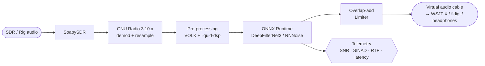

import FlowgraphRenderer from '@site/src/components/FlowgraphRenderer';

# Architecture

RFWhisper is a thin layer of glue on top of a small number of very good libraries.



## Principles

1. **Local-first.** No runtime network calls. Models fetched once (SHA-256 verified) and cached.
2. **Latency is a feature.** p99 &lt; 100 ms v0.1, &lt; 50 ms v0.3. See [Latency Budget](./latency-budget).
3. **Preserve the signal.** Classical DSP handles what it's good at (resampling, notching, framing); the NN handles what it's good at (complex stationary + impulsive noise mixtures). Neither replaces the other.
4. **Predictable.** Preallocated buffers, released GIL in hot paths, no hidden reallocations per frame.
5. **Swappable.** Models are ONNX artefacts loaded at runtime; swap DFN3 ↔ RNNoise ↔ your own with a CLI flag or a GUI dropdown.

## Runtime topology

### Threads

| Thread | Priority | Responsibility |
|---|---|---|
| Audio capture | Realtime (SCHED_FIFO / Pro Audio MMCSS / mach thread constraint) | Pulls frames from the input device into a lock-free SPSC ring |
| Pre / Inference / Post | Realtime | Pops a frame, runs feature extraction → ONNX → overlap-add → pushes to output ring |
| Audio output | Realtime | Drains the output ring to the device |
| Telemetry | Nice +5 | Samples HDR histograms every second; writes JSON/TB logs if enabled |
| GUI (when running) | Default | Never blocks the audio path |

### Buffers

Every buffer is **preallocated at startup** to the worst-case frame size. Audio callbacks do zero allocation, zero locking.

## Subsystems

### DSP (classical)

Lives in `rfwhisper/dsp/`. Windowing, STFT (via liquid-dsp), polyphase resampling, pre/de-emphasis, overlap-add, and the adaptive narrowband notch (v0.3). VOLK kernels for the kernels that matter.

→ [Signal Flow](./signal-flow) for the detailed block-by-block view.

### Inference

Lives in `rfwhisper/models/`. Thin ONNX Runtime wrapper:

- Providers chosen in order: CoreML → DirectML → CUDA → XNNPACK → CPU.
- Session options: `intra_op_num_threads` tuned per target, `inter_op_num_threads = 1`, `enable_cpu_mem_arena=True`.
- I/O tensors are **pinned** and reused per frame.
- FP32 + INT8 (QDQ) variants ship side-by-side; users pick via `--model-variant`.

→ [Models](../models/) for training, fine-tuning, and the model hub.

### Real-time runtime

Lives in `rfwhisper/realtime/`. PortAudio / WASAPI / CoreAudio / ALSA backends with a unified callback surface. Lock-free SPSC rings between stages. HDR histograms for p50/p95/p99.

### GNU Radio integration (v0.2+)

Lives in `gr-rfwhisper/` (OOT module) and `flowgraphs/` (per-SDR `.grc` files). Uses stock [`gr-dnn`](https://github.com/gnuradio/gr-dnn) where possible; adds our own blocks where we need runtime model-swap, telemetry, and profile awareness.

<FlowgraphRenderer
  name="rtl_ssb_hf"
  sdr="RTL-SDR v4"
  mode="USB (HF)"
  source="flowgraphs/rtl_ssb_hf.grc"
  description="Minimal HF SSB denoiser flowgraph — the v0.2 reference pipeline.">
{`
flowchart LR
  A([RTL-SDR v4<br/>2.048 Msps]) --> B[SoapySDR Source]
  B --> C[Freq Xlating FIR<br/>decimate 64]
  C --> D[SSB Demod<br/>USB/LSB]
  D --> E[Audio Resampler<br/>→ 48 kHz]
  E --> F["gr-dnn · DeepFilterNet3"]
  F --> G[Overlap-add / Limiter]
  G --> H[/Virtual Cable/]
  F -.-> T{{Telemetry}}
`}
</FlowgraphRenderer>

→ [Flowgraphs](./flowgraphs) has one per SDR.

## Where things live in the repo

```
rfwhisper/
├── constants.py            ← shared constants (rates, frame sizes, opset)
├── dsp/                    ← classical DSP (windows, STFT, resample, notch)
├── models/                 ← ONNX loaders, providers, registry, fetch
├── realtime/               ← audio backends, SPSC rings, scheduling
├── profiles/               ← YAML per-mode (ssb.yaml, cw.yaml, ft8.yaml, …)
├── gui/                    ← PySide6 app (v0.4)
├── train/                  ← fine-tuning pipeline (v0.5)
├── bench/                  ← latency probe, RTF, CPU, memory
└── cli.py                  ← the rfwhisper command
gr-rfwhisper/               ← GNU Radio OOT module (C++ + GRC YAML)
flowgraphs/                 ← .grc + generated .py
tests/audio/                ← acceptance harness tied to ROADMAP criteria
```

## Dependencies at a glance

| Purpose | Library | License |
|---|---|---|
| DSP framework | GNU Radio 3.10.x | GPLv3 |
| SDR abstraction | SoapySDR | Boost |
| Inference | ONNX Runtime | MIT |
| Classical DSP primitives | liquid-dsp | MIT |
| SIMD kernels | VOLK | GPLv3 |
| Primary model | DeepFilterNet3 | MIT / Apache-2.0 |
| Fallback model | RNNoise | BSD-3-Clause |
| Audio backends | PortAudio / WASAPI / CoreAudio / ALSA | Varies (all permissive) |
| GUI | PySide6 / Qt 6 | LGPL |
| Packaging | PEP 621 `pyproject.toml` | — |

All GPLv3-compatible.
