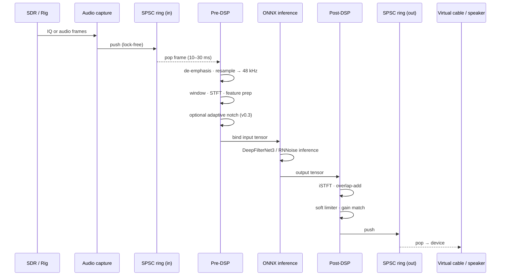

# Signal Flow

Everything RFWhisper does, in order, from antenna (or rig audio) to your decoder.

## Stage-by-stage detail

### 1. Audio capture

- **Backends:** PortAudio (Linux/mac), WASAPI (Windows), CoreAudio (mac native), ALSA (Linux native).
- **Frame sizes:** 10–30 ms native (160–480 samples @ 16 kHz; 480–1440 @ 48 kHz). Default 10 ms at 48 kHz for DFN3.
- **Sample format:** `float32` internally. Device-side conversion via the backend.
- **Thread:** realtime priority where OS allows.

### 2. SPSC rings

Single-producer single-consumer lock-free ring between capture and processing, and between processing and output. Tuned to ~4 frames of headroom; larger buffers trade latency for safety against device jitter.

### 3. Pre-DSP (`rfwhisper/dsp/`)

In order:

1. **De-emphasis** (if input is NBFM) — 50 µs / 75 µs curves.
2. **Polyphase resample** to model native rate (48 kHz for DFN3 / RNNoise-ham). Uses `liquid_msresamp`. Never `scipy.signal.resample` in the hot path.
3. **Windowing** (Hann by default; sqrt-Hann when the output chain also windows). VOLK-accelerated.
4. **STFT** via liquid-dsp FFT plans, plans reused across frames.
5. **Feature prep** — model-specific. DFN3 ingests spectrogram mag+phase; RNNoise uses its custom 42-dim bark features (handled inside the ONNX graph).
6. **(v0.3) Adaptive narrowband notch** — classical LMS / gated IIR that removes stable carriers *before* the NN. Off by default for CW/FT8 profiles.

All preallocated. Zero Python in the per-frame critical path (we use C extensions / numpy views with pre-cast buffers).

### 4. ONNX inference (`rfwhisper/models/`)

- Execution provider chosen by rank: `CoreML → DirectML → CUDA → XNNPACK → CPU`. Override with `RFWHISPER_PROVIDER=...`.
- I/O tensors allocated once; bound via ONNX Runtime's IO binding API.
- `intra_op_num_threads` tuned per-target (see [Performance / Embedded](../../AGENTS.md) if you're reading in the repo).
- GIL released around `OrtRun`.

### 5. Post-DSP

1. **iSTFT + overlap-add** with matched window. Overlap-add windows must sum to 1.0 — verified in unit tests.
2. **Gain match** — output RMS matched to input RMS on a slow AGC to avoid perceived level jumps when toggling bypass.
3. **Soft limiter** — catches occasional NN overshoots, never touches normal levels.

### 6. Output ring + device

Symmetric to the input side. Drains to the virtual cable or speaker.

## Per-profile variations

Mode profiles (YAML in `rfwhisper/profiles/`) tweak:

- NN aggressiveness (blend factor 0.0–1.0)
- Notch enable + bandwidth (v0.3)
- De-emphasis on/off
- Attack / release envelopes for the soft limiter
- Frame size (longer windows for FT8, shorter for CW transient preservation)

| Profile | NN aggression | Notch | Frame | Rationale |
|---|---|---|---|---|
| `ssb` | 0.9 | off | 10 ms | Speech intelligibility |
| `cw` | 0.6 | off | 5 ms | Transient preservation is paramount |
| `ft8` | 0.7 | off | 20 ms | Decoder tolerates latency; be gentler |
| `ft4` | 0.8 | off | 10 ms | — |
| `fm-narrow` | 0.9 | optional | 10 ms | De-emphasis first |
| `vhf-ssb` | 0.85 | optional | 10 ms | Weak-signal-friendly |

Latency measurements per stage live in [Latency Budget](./latency-budget).
